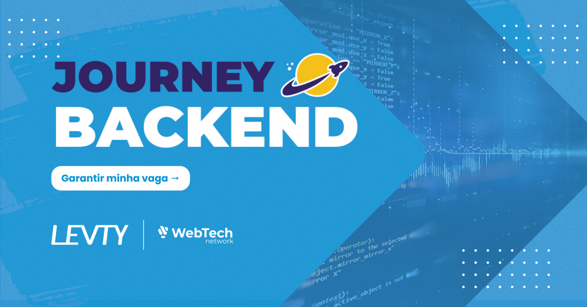

<div  align="center" id="about">
    <h1 align="center">
        Chapter Backend – Repositório de Apoio da Etapa 2
    </h1>
    <p align="center">
        Este repositório reúne os códigos-fonte, exemplos práticos e materiais complementares desenvolvidos durante a segunda etapa do Journey Backend, uma jornada de aprendizado em desenvolvimento back-end com Node.js e Express, realizada em parceria entre o WebTech Network e a LEVTY. Ele documenta exclusivamente os conteúdos abordados nessa segunda fase, com o objetivo de apoiar os participantes no estudo, na revisão de conceitos e na aplicação prática dos temas trabalhados em aula.
    </p>
    
</div>
<br>
<div align="center">
    <a href="https://github.com/webtech-network/journey-backend_levty-etapa2" target="_blank">
        
    </a>
    <a href="https://github.com/webtech-network/journey-backend_levty-etapa2" target="_blank">
        
    </a>
    <a href="https://github.com/webtech-network/journey-backend_levty-etapa2" target="_blank">
        
    </a>
    <a href="https://github.com/webtech-network/journey-backend_levty-etapa2/blob/main/LICENSE.md" target="_blank">
        
    </a>
</div>

---

<div id="table-of-contents"></div>

## 📋 Tabela de conteúdos

-   [Sobre](#about)
-   [Tabela de conteúdos](#table-of-contents)
-   [O que você encontrará neste repositório](#features)
-   [Configuração e Execução da Aplicação](#setup-and-run-the-application)
-   [Tecnologias](#technologies)
-   [Autor](#author)
-   [Licença](#license)

<div id="features"></div>

## 📝 O que você encontrará neste repositório

-   [x] Códigos-fonte das aulas explicados de forma clara e prática
-   [x] Exemplos utilizados nos hands-on durante o Journey Backend
-   [x] Atividade resolvida (disponibilizadas após o encerramento da etapa)
-   [x] Códigos extras solicitados pela comunidade para reforço do conteúdo

<div id="setup-and-run-the-application"></div>

## 📁 Configuração e Execução da Aplicação

### ⚙️ Pré-requisitos

Antes de começar, você precisa ter as seguintes ferramentas instaladas na sua máquina: [Git](https://git-scm.com) e [Node.js](https://nodejs.org/).

Também é recomendável utilizar um editor de código como o [Visual Studio Code](https://code.visualstudio.com/).

### 🚀 Como Rodar a Aplicação Localmente

```bash
# Clone este repositório
$ git clone https://github.com/webtech-network/journey-backend_levty-etapa2.git

# Acesse a pasta do projeto
$ cd {nome_da_pasta}

# Execute o arquivo principal
$ node server.js
```

> Obs.: Certifique-se de que o arquivo server.js esteja configurado corretamente como o ponto de entrada do seu projeto. Se o nome do arquivo for diferente, ajuste o comando de execução conforme necessário.

Após a execução, o servidor será iniciado — geralmente na porta `3000`.

Acesse a aplicação no navegador através do endereço:

```plaintext
http://localhost:3000
```

<div id="technologies"></div>

## 💻 Tecnologias

As seguintes tecnologias foram utilizadas ao longo do desenvolvimento dos exemplos e atividades deste repositório:

-   [JavaScript](https://developer.mozilla.org/pt-BR/docs/Web/JavaScript): Linguagem de programação utilizada tanto no front-end quanto no back-end dos projetos.
-   [Node.js](https://nodejs.org/): Ambiente de execução JavaScript no lado do servidor, utilizado para construir a lógica de back-end das aplicações.
-   [Express.js](https://expressjs.com/pt-br/): Framework web para Node.js que facilita a criação de APIs e servidores com uma sintaxe simples e poderosa.

<div id="author"></div>

## 👨🏻‍💻 Autor

---

| [<br><sub>Artur Bomtempo</sub>](https://arturbomtempo.dev/) |
| :--------------------------------------------------------------------------------------------------------------------------------------------------: |

Desenvolvido por Artur Bomtempo 👋🏻. Entre em contato:

[](mailto:arturbcolen@gmail.com)
[](https://www.linkedin.com/in/artur-bomtempo/)
[](https://www.instagram.com/arturbomtempo.dev/)

<div id="license"></div>

## 📜 Licença

Copyright (c) 2025 WebTech Network

Por meio deste, é concedida permissão, gratuitamente, a qualquer pessoa que obtenha uma cópia
deste software e dos arquivos de documentação associados (o "Software"), para tratar
no Software sem restrição, incluindo, sem limitação, os direitos
de usar, copiar, modificar, mesclar, publicar, distribuir, sublicenciar e/ou vender
cópias do Software, e permitir que pessoas a quem o Software seja fornecido o façam, sujeito às seguintes condições:

O aviso de copyright acima e este aviso de permissão devem ser incluídos em todas
as cópias ou porções substanciais do Software.

O SOFTWARE É FORNECIDO "COMO ESTÁ", SEM GARANTIA DE QUALQUER NATUREZA, EXPRESSA OU
IMPLÍCITA, INCLUINDO, MAS NÃO SE LIMITANDO ÀS GARANTIAS DE COMERCIALIZAÇÃO,
ADEQUAÇÃO A UM FIM ESPECÍFICO E NÃO INFRAÇÃO. EM NENHUM CASO OS
AUTORES OU TITULARES DOS DIREITOS AUTORAIS SERÃO RESPONSÁVEIS POR QUALQUER RECLAMAÇÃO, DANOS OU OUTRAS
RESPONSABILIDADES, SEJA EM UMA AÇÃO DE CONTRATO, AGRAVO OU DE OUTRA FORMA, DECORRENTES DE,
OU EM CONEXÃO COM O SOFTWARE OU O USO OU OUTRAS NEGOCIAÇÕES NO
SOFTWARE.
